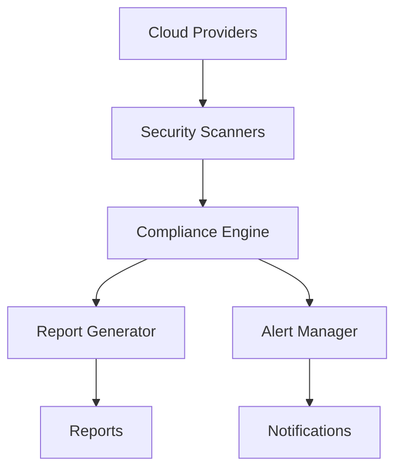

# Cloud Security Compliance Automation

A comprehensive solution for automating security compliance checks across multiple cloud providers (AWS, Azure, and GCP), with real-time alerting and detailed reporting capabilities.

## Features

- **Multi-Cloud Support**
  - AWS Security Scanner
  - Azure Security Scanner
  - GCP Security Scanner

- **Real-time Security Alerting**
  - Email notifications
  - Slack integration
  - Configurable severity levels
  - Alert aggregation and rate limiting

- **Compliance Reporting**
  - HTML-based reports
  - Visual compliance dashboards
  - Trend analysis
  - Framework-specific assessments

- **Automated Security Checks**
  - IAM policies and permissions
  - Network security configurations
  - Encryption settings
  - Logging and monitoring
  - Access controls

## Architecture

The system is built with a modular architecture that enables easy extension and maintenance. For detailed architecture diagrams, see [Architecture Documentation](docs/architecture.md).

### High-level Overview



## Getting Started

### Prerequisites

- Python 3.8 or higher
- AWS/Azure/GCP credentials with appropriate permissions
- SMTP server for email notifications
- Slack webhook URL for Slack notifications

### Installation

1. Clone the repository:
```bash
git clone https://github.com/yourusername/cloud-security-compliance-automation.git
cd cloud-security-compliance-automation
```

2. Install dependencies:
```bash
pip install -r requirements.txt
```

3. Configure environment variables:
```bash
export SMTP_USERNAME=your-email@gmail.com
export SMTP_PASSWORD=your-app-specific-password
export SLACK_WEBHOOK_URL=https://hooks.slack.com/services/xxx/yyy/zzz
```

4. Update configuration files in `config/` directory

### Usage

1. Run security scan:
```bash
python src/main.py scan --provider aws
```

2. Generate compliance report:
```bash
python src/main.py report
```

3. Start monitoring:
```bash
python src/main.py monitor
```

## Configuration

### Alert System Configuration

Configure notification channels and alert settings in `config/alert_config.yaml`:

```yaml
channels:
  - type: email
    enabled: true
    smtp_host: smtp.gmail.com
    # ... other email settings

  - type: slack
    enabled: true
    webhook_url: ${SLACK_WEBHOOK_URL}
    # ... other slack settings
```

### Scanner Configuration

Configure cloud provider settings in `config/scanner_config.yaml`:

```yaml
aws:
  regions:
    - us-east-1
    - us-west-2
  services:
    - iam
    - s3
    - ec2
    # ... other services

azure:
  # Azure configuration

gcp:
  # GCP configuration
```

## Development

### Running Tests

```bash
# Run all tests
pytest

# Run specific test category
pytest tests/unit/
pytest tests/integration/
```

### Adding New Features

1. Create feature branch:
```bash
git checkout -b feature/your-feature-name
```

2. Implement changes
3. Add tests
4. Submit pull request

## Contributing

1. Fork the repository
2. Create your feature branch
3. Commit your changes
4. Push to the branch
5. Create a Pull Request

## License

This project is licensed under the MIT License - see the [LICENSE](LICENSE) file for details.

## Acknowledgments

- Cloud provider security best practices
- Security compliance frameworks
- Open source security tools

## Contact

For questions and support, please open an issue or contact the maintainers. 