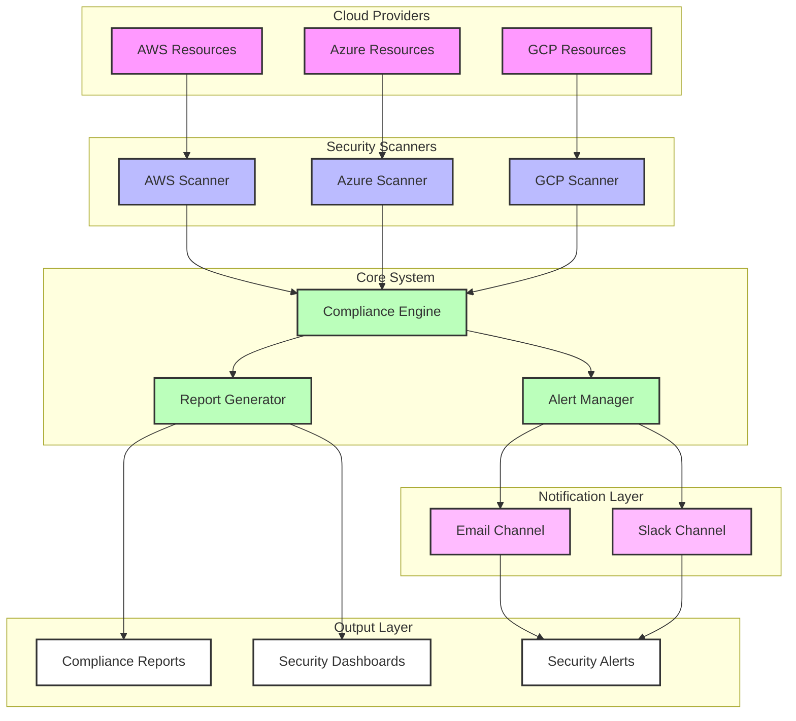
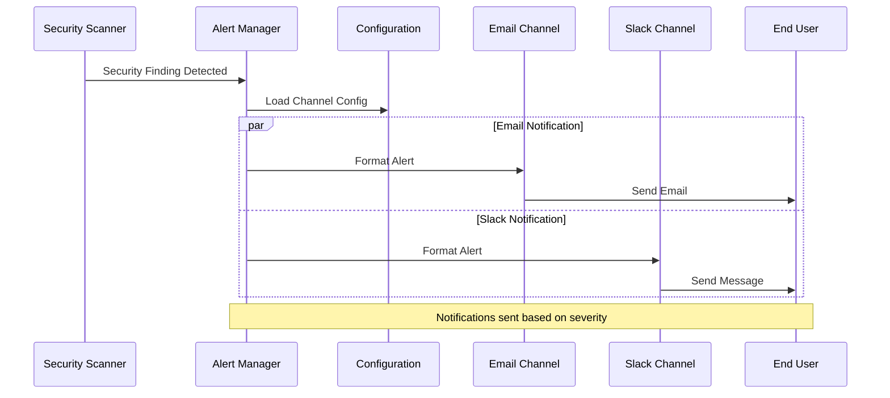
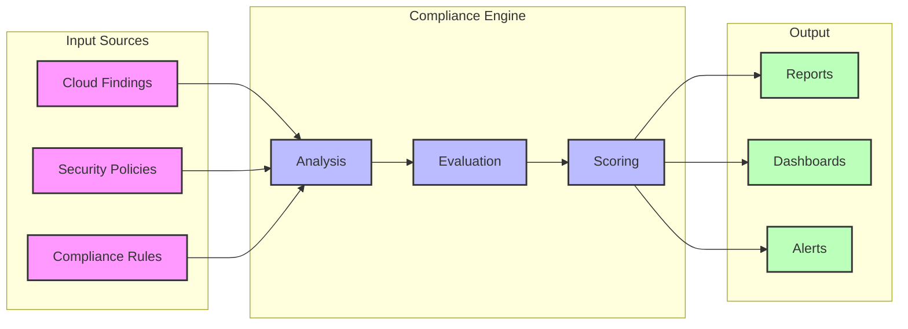
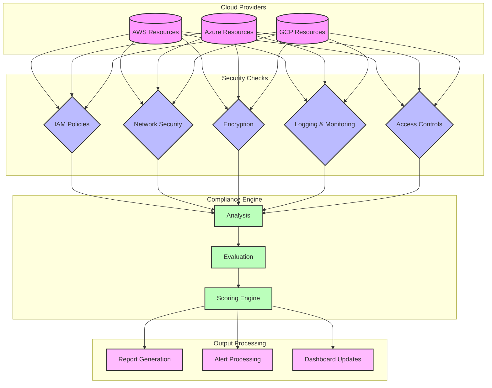
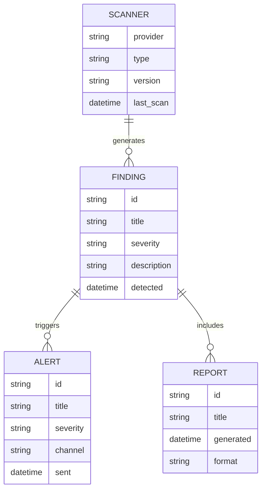
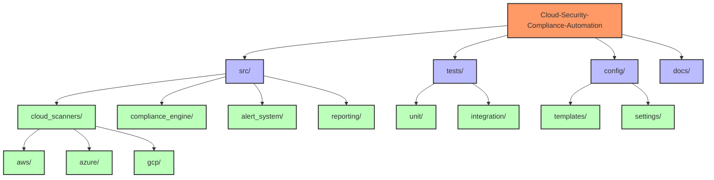

# Cloud Security Compliance Automation Architecture

## System Overview

## Alert System Flow

## Compliance Engine Flow

## Data Flow

## Component Relationships

## Directory Structure

These diagrams provide a comprehensive view of:
1. Overall system architecture and component relationships
2. Alert system flow and notification process
3. Compliance engine data processing
4. Data flow between different system components
5. Entity relationships
6. Project directory structure

The diagrams are designed to help:
- New developers understand the system architecture
- DevOps teams plan deployments
- Security teams understand the compliance workflow
- Stakeholders visualize the system's capabilities 